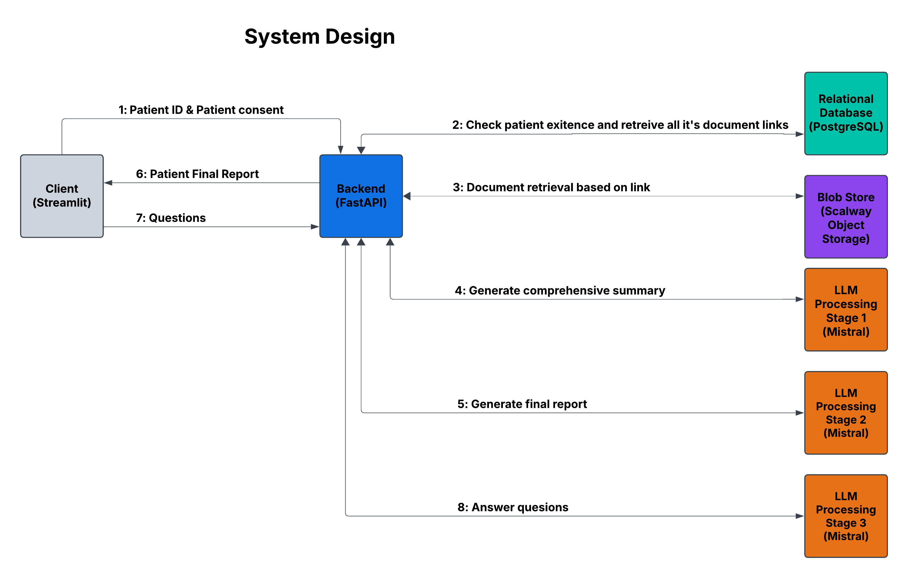
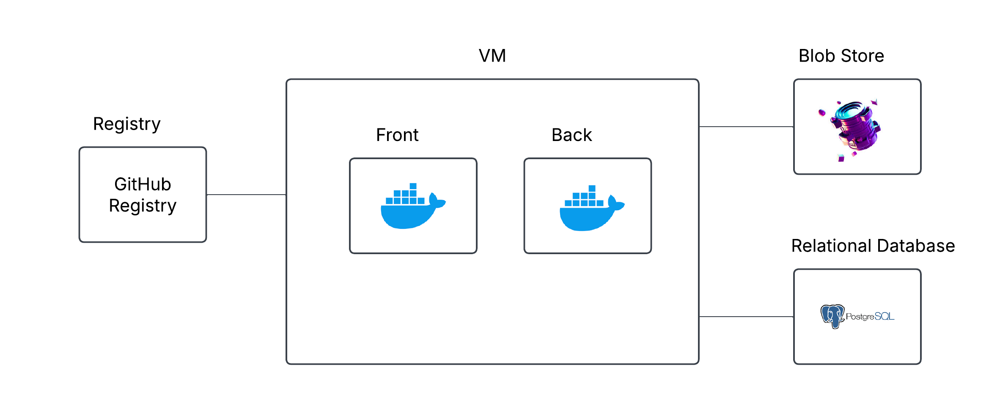

# 💚 Consultation Warm Up 💚

## Summary

Breaking the "blind date" barrier between a doctor and a new patient by providing quick, AI-powered insights into their health history, transforming the interaction from a cold to a warm approach💚, leading to more informed decisions and better patient outcomes.

## Team

Team Name: "Warn Approach 💚"

Team members: Alex Kolodzig | Nabil Aitbaha | Ibrahi Almajai | Abdarrahmane Neine

Submission for AI Action Summit Hackathon 2025

## Live Demo

A live version (using the mock backend) can be found here:
👉 [Live Demo](https://ai-action-summit-hackathon-2025-alex.streamlit.app/)

## Docs

- [Why is it important?](docs/use_case.md)
- [App (Frontend)](docs/frontend_docs.md)
- [Backend](docs/backend.md)
- [Slides](https://docs.google.com/presentation/d/1T6y0O-rRlIoL2fT7aEIoUAX9gLt2In5OdceLSxARWpc)

## App Description

A Streamlit application that simulates a patient lookup and medical record analysis workflow. The app demonstrates how to:

1. Look up a patient's medical records by a given identifier (e.g., Social Security Number).
2. Obtain patient consent for searching and analyzing medical records.
3. Generate a comprehensive medical report from a backend and using the Mistral API.
4. Provide a question-and-answer interface using a Mistral LLM to further query the report.

### Features

- **Patient Lookup**: Checks if a patient exists (mocked in this example).
- **Consent Workflow**: User must explicitly confirm that patient consent has been provided to continue.
- **Comprehensive Report Generation**: Uses either a mock function or a Mistral model to generate a summary and final report.
- **Interactive Q&A**: Embeds a chat interface allowing users to ask follow-up questions about the patient’s medical history, with the option to download the chat transcript.
- **Report Download**: Allows you to download the generated medical report as a text file.

## System Design

## Infrastructure

